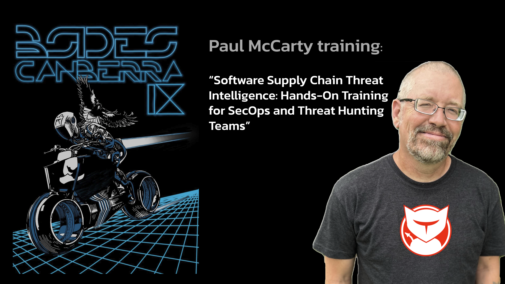

# Paul McCarty (6mile) - BSides Canberra 2026

## Software Supply Chain Threat Intelligence: Hands-On Training for SecOps and Threat Hunting Teams



**Instructor:** Paul McCarty ([sourcecodered.com](https://sourcecodered.com), [OpenSourceMalware.com](https://opensourcemalware.com))

**Format:** All-day hands on workshop

**Level:** Intermediate

---

## What you'll walk away with

- Detect, analyze, and extract actionable intelligence from real supply chain malware across **NPM, PyPI, GitHub, and VS Code**.
- Hands-on time inside sanitized samples from active campaigns — **Contagious Interview** (DPRK), **PolinRider** (DPRK), and **GlassWorm** (Russia).
- A working CTI workflow: **triage → IOC extraction → infrastructure pivot → attribution → reporting → community disclosure**.
- A curated open-source toolbox (see [`references/TOOLING.md`](references/TOOLING.md)) you can take back to your team.
- Practice under time pressure: a 90-minute live-hunt CTF against a fresh candidate corpus.

## Rules of engagement

> ⚠ Every sample in `compromised-assets/` is **live malware**. Treat it that way.

1. Run everything in a **VM, container, or sandbox** with network egress under your control. Never on your work laptop's host OS.
2. Do **not** open any repo in VS Code / Cursor / Windsurf on your host — several samples weaponize `.vscode/tasks.json`, `.vscode/extensions/*.woff2`, and other IDE trust primitives.
3. Do **not** run `npm install`, `pip install`, or `code --install-extension` against samples on any machine that touches production credentials, cloud CLIs, browser profiles, or crypto wallets.
4. Assume every hostname / IP / wallet / bot token you see is **hostile infrastructure**. Passive lookups (DNS, WHOIS, VirusTotal, Shodan) are fine. Do **not** interact directly.
5. If you find live, previously-undocumented malicious infrastructure during the CTF, follow the disclosure workflow from Module 5 — don't tweet the IOCs before the maintainer is notified.

## Prerequisites

Before you arrive, follow [`SETUP.md`](SETUP.md). Minimum:

- A fresh VM (VirtualBox / UTM / Parallels / cloud) — Ubuntu 22.04+ or macOS-in-VM works.
- Baseline CLI: `git`, `gh` (authenticated), `jq`, `curl`, `python3`, `node`, `npm`, `unzip`, `strings`, `file`, `sha256sum`, `rg`, `fd`.
- Open-source hunting tools per [`references/TOOLING.md`](references/TOOLING.md) — `setup-verify.sh` at repo root confirms everything is installed.
- A GitHub account with `gh` authenticated.
- (Optional but recommended) An account on the community threat DB you'll use in Module 5.

## Schedule

| Block | Time | What you do |
|---|---|---|
| Kickoff | 30m | Threat landscape, taxonomy, ROE. Slides `00–01`. |
| Module 1 — GitHub | 122m | Labs 1a, 1b, 1c, 1d, **1e (YARA)** |
| Break | 7m | |
| Module 2 — NPM | 125m | Labs 2a, 2b, 2c, 2d, **2e (YARA)** |
| Module 3 — PyPI | 70m | Labs 3a, 3b, **3c (YARA)** |
| Lunch | 45m | |
| Module 4 — VS Code | 85m | Slides `02` + Labs 4a, 4b, **4c (YARA)** |
| Module 5 — CTI workflow | 60m | Labs 5a, 5b, 5c |
| Break | 5m | |
| CTF finale | 45m | Live hunt + disclosure |
| Wrap | 11m | Debrief, resources, Q&A |

## Repo layout

```
.
├── README.md                    # this file
├── INSTRUCTOR.md                # timing script, contingencies
├── SETUP.md                     # attendee setup checklist
├── setup-verify.sh              # environment check
├── slides/                      # Marp source
├── module-2-npm/                # 3 labs
├── module-3-pypi/                # 2 labs
├── module-1-github/              # 4 labs
├── module-4-vscode/              # 2 labs
├── module-5-cti-workflow/        # 3 labs
├── ctf/                          # 90-min finale
├── compromised-assets/           # live samples (SANDBOX ONLY)
├── references/                   # cheatsheets, IOC master table, TOOLING.md
└── rmcej-otb-forks-analysis.csv  # PolinRider fork dataset
```

Each lab has its own `HANDOUT.md` — read it, run it, ask questions.

## Master IOC index

See [`references/IOC-master-table.md`](references/IOC-master-table.md). Every hostname, IP, wallet, npm package, PyPI package, GitHub account, and VSIX referenced across the day is indexed there so you can cross-check as you pivot.

## Credit and further reading

Case studies in this workshop are drawn from Paul's public threat intel at [OpenSourceMalware.com](https://opensourcemalware.com) — the specific posts each lab uses are cited inside its `HANDOUT.md`. This training builds on the 2-hour DEF CON / BSides SF / RSA workshop "Hunting DPRK Supply Chain Attacks" — the Canberra version broadens scope to all four attack surfaces and adds a live-hunt CTF.
